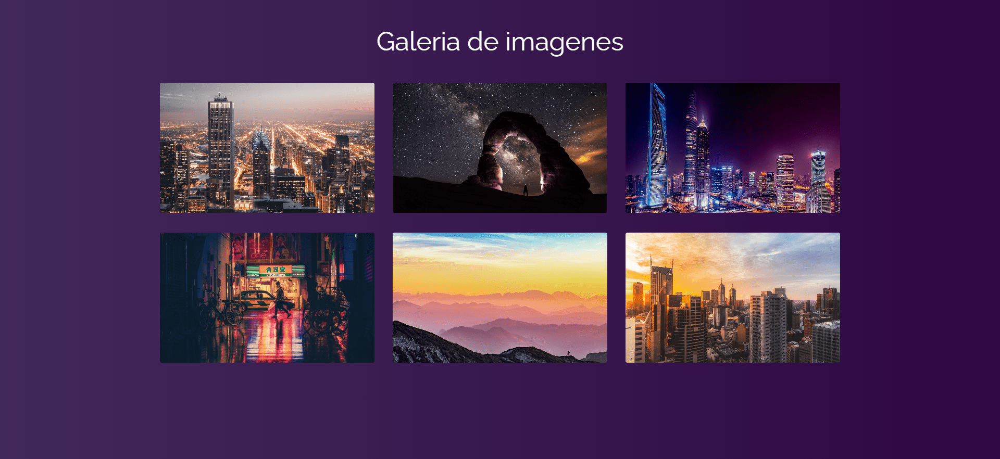

# Proyecto 003-Galería de imágenes.
Flexbox CSS es un sistema de maquetación unidimensional, pensado principalmente para el acomodo interno de los elementos, componentes y/o widgets de una interfaz de usuario. Se realizó el proyecto 003-Galería de imágenes responsive.  🏆   

