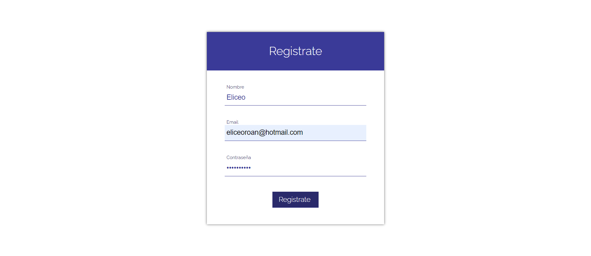

# Proyecto 004-Formulario-de-login.
Flexbox CSS es un sistema de maquetación unidimensional, pensado principalmente para el acomodo interno de los elementos, componentes y/o widgets de una interfaz de usuario. Se realizó el proyecto 004-Formulario-de-login. 🏆   

