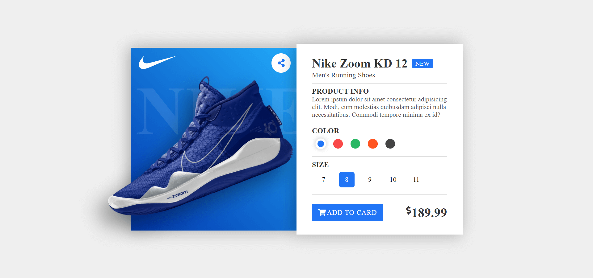

# Proyecto 005-Card.
Flexbox CSS es un sistema de maquetación unidimensional, pensado principalmente para el acomodo interno de los elementos, componentes y/o widgets de una interfaz de usuario. Se realizó el proyecto 005-Card responsive.  🏆   

