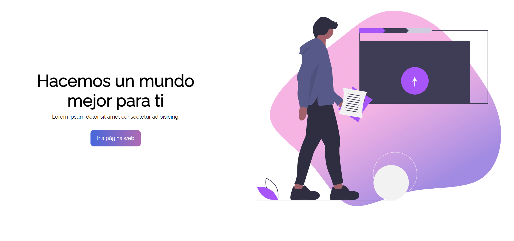

# Proyecto 002-Landin-page 🏆.
Flexbox CSS es un sistema de maquetación unidimensional, pensado principalmente para el acomodo interno de los elementos, componentes y/o widgets de una interfaz de usuario. Se realizó el proyecto 002-Landin-page 💻.   

