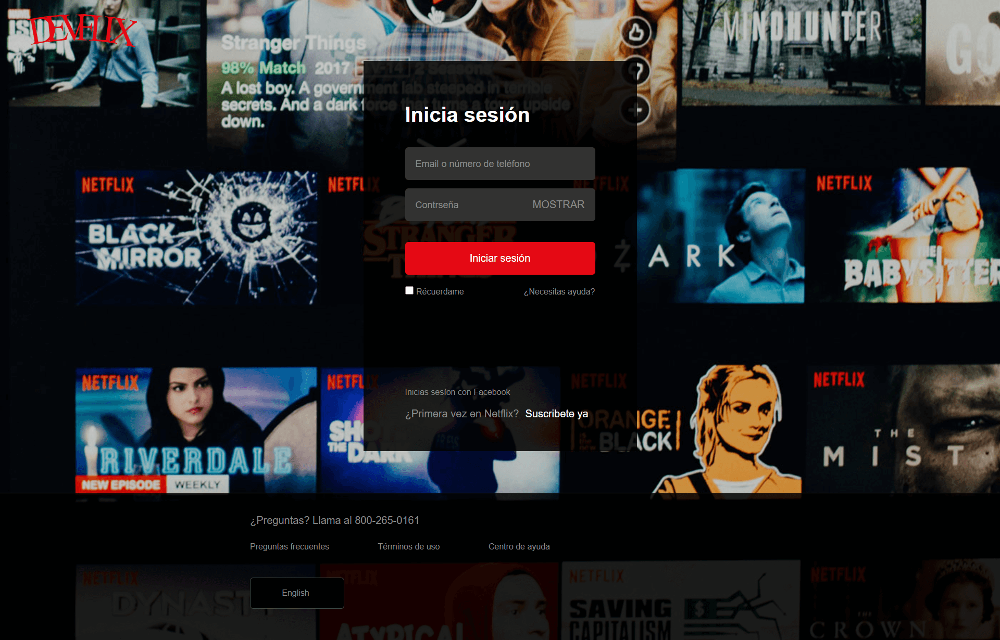

# Proyecto 005-Página-web.
Flexbox CSS es un sistema de maquetación unidimensional, pensado principalmente para el acomodo interno de los elementos, componentes y/o widgets de una interfaz de usuario. Se realizó el proyecto 004-Página-web responsive.  🏆
## Instala los módulos de Node nuevamente.
Run `npm install`
## Instala los gulp nuevamente.
Run `npm install --save-dev gulp`
## Instala los gulp-autoprefixer, gulp-sass y node-sass nuevamente.
Run `npm install --save-dev gulp-autoprefixer gulp-sass node-sass `
  

